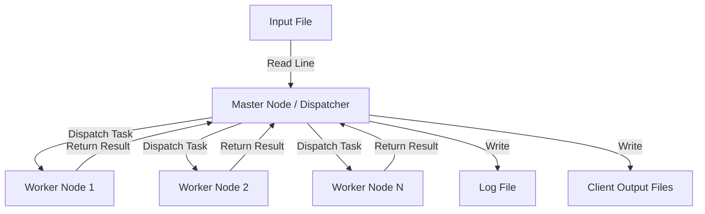

# MPI Job Dispatcher - Server Cluster Simulation

## 📌 Project Overview
This project simulates a **distributed server cluster** using the **Master-Worker** architecture implemented with **MPI (Message Passing Interface)**.

The application is designed to process a stream of client commands concurrently. A designated **Master** process (Job Dispatcher) reads commands from an input file and dispatches them to available **Worker** processes. The system handles concurrent activities, load balancing, and logging, simulating a real-world high-performance computing scenario.

## 🚀 Features

* **Master-Worker Architecture:** Efficient separation of concerns where Rank 0 handles I/O and scheduling, while Ranks 1 to N perform computations.
* **Dynamic Load Balancing:** The Master assigns tasks only to idle workers, ensuring efficient resource utilization.
* **Concurrency Support:** Handles multiple types of tasks simultaneously.
* **Logging System:** Records precise timestamps for task reception, dispatch, and completion.
* **Client Isolation:** Generates separate output files for each client.
* **Bursty Traffic Simulation:** Supports `WAIT` commands in the input stream to simulate irregular arrival of requests.

## 🛠 Supported Commands

The cluster supports the following computational tasks:

1.  **`PRIMES N`**: Calculates the count of prime numbers up to $N$.
2.  **`PRIMEDIVISORS N`**: Finds the number of prime divisors for the integer $N$.
3.  **`ANAGRAMS string`**: Generates all permutations (anagrams) of a given string (max 8 chars).

## ⚙️ Architecture

📋 Requirements
C Compiler (GCC recommended)

MPI Implementation (e.g., MPICH, OpenMPI on Linux, or MS-MPI on Windows)

🔧 Compilation & Usage
1. Compilation
   On Linux (OpenMPI/MPICH):
   gcc -g job_dispatcher.c -I "C:\Program Files (x86)\Microsoft SDKs\MPI\Include" -L "C:\Program Files (x86)\Microsoft SDKs\MPI\Lib\x64" -lmsmpi -o job_dispatcher.exe

2. Running the Application
      To run the simulation with N processes (1 Master + N-1 Workers):
   mpiexec -n 4 job_dispatcher input_commands.txt
   Replace 4 with the desired number of processes.

📂 Input & Output Format
Input File Example (commands.txt):

CLI0 PRIMEDIVISORS 452876
CLI1 ANAGRAMS tralala
CLI2 PRIMEDIVISORS 129072
WAIT 2
CLI3 PRIMES 2908764

Output
Client Files: CLI0.out, CLI1.out, etc. (Containing the result of the command).
General Log: A file recording the flow of execution:
[TIME] Received: CLI0 PRIMEDIVISORS 452876
[TIME] Dispatched CLI0 to Worker 1
[TIME] Finished CLI0 (Worker 1)

📊 Performance Analysis
The project includes a performance measurement module that compares the Parallel Execution Time against a Serial Implementation. Speedup is calculated to demonstrate the efficiency of the cluster.